# My First Contract

## Register a new Account
Before you get started with ECM, you'll have to register a new account. This account is based on your email address and the password associated is particular to ECM. When you register an account for the first time, it will be marked as pending. And administrator will have to associate your account with the department you're in. Follow the instructions below. 

[Registering a New Account](registering.md)

When you have received confirmation that your account was created, it's time to create your first contract. 

## Creating a Uniform Contract

From the home ribbon click on the forms button to start your selection. 

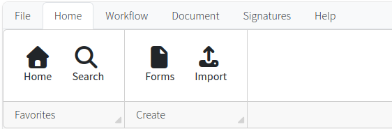

Based upon purchasing guidelines, select the contract you would like to create and click the create button. 

New contract and supporting documentation templates will be made available as they are created. Keep an eye on the homepage for a list of new changes and updates. 

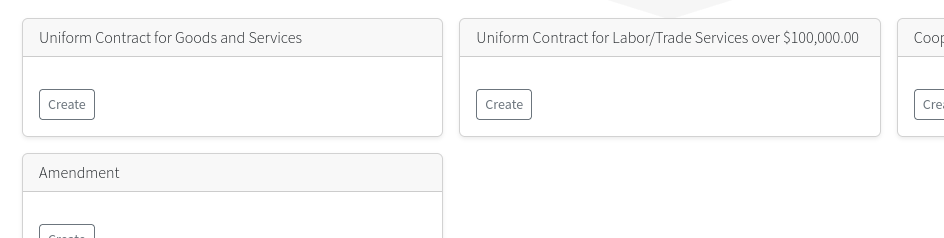

Fill out the form completely. In the event one of the values you entered is not correct, a red error box will appear. Make your corrections and resubmit until the contract creation is successful. 

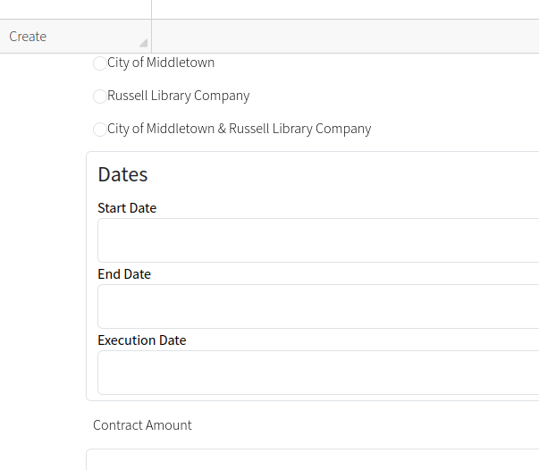

At the bottom of every form is a drop down list to select department. Please make sure to select the appropriate department. Department have a designated two character code with a prefix of ECM. 

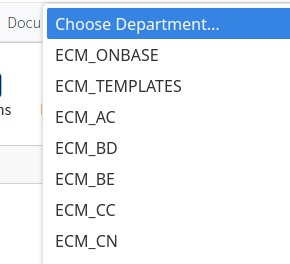

For best practices when filling out contract forms, see our section on [Best Practices](../guides/best_practices.md).

## Submit Contract for Review

After the contract is created, the department will be responsible for adding any supporting documentation and or notes to the contract before submitting it for review. Any contract that resides in the department review queue is waiting for action. You can access your department's review queue by navigating to the workflow ribbon and selecting workflow. 

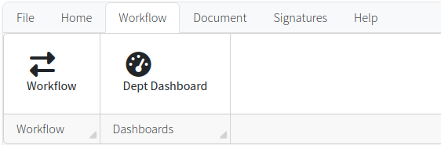

Next, open up the appropriate department review queue. If you have access to more than one department, they will be listed under the contract approval process toolbar. 

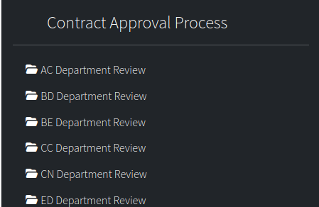

Once opened, you'll see a list of contracts currently in your queue with links to open them on the left-hand side. 

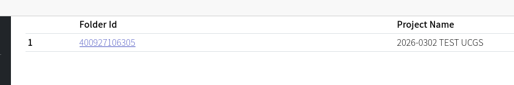

If you are having any issues viewing a contract, there are a couple of quick solutions. Please visit our [FAQ](../guides/faqs.md) section for more advice. 

## Add Supporting Documentation

Consult your purchasing guides for a list of required supporting documentation per contract. To add supporting documentation, click on the button in the document ribbon. 

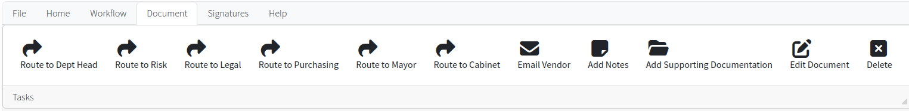

Select the document type from the approved list of document types. Click on the browse button to select the file to upload. 

For best practices when adding supporting documentation, see our section on [Best Practices](../guides/best_practices.md).

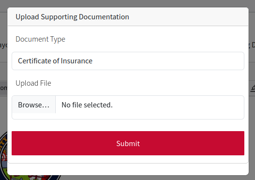

When you add a piece of supporting documentation, you will immediately be redirected to view that page. When opening any supporting documentation, you can quickly return to the main contract by selecting the contract button, the top right hand toolbar. 

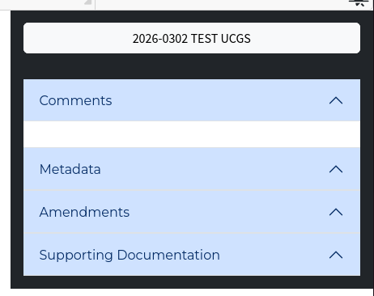

When viewing the contract or any supporting documentation, links to all additional supporting documentation are available by expanding the panel on the right hand toolbar. 

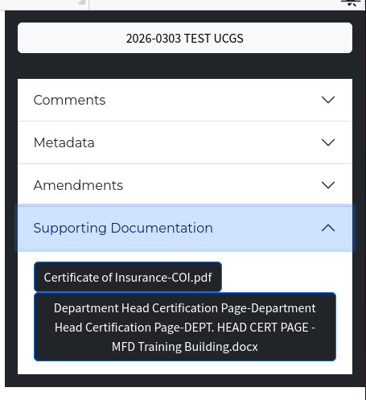

**Items to pay attention to**

    1. When submitting supporting documentation, the file name will automatically be prefixed with the document type. As shown in the example above. 
        - Be aware when naming the file to be uploaded. It is best practice to avoid reiteration.  See example above. 
        - This is in contrast to uploading the primary contract file, which changes its name to the project name specified in the initial form. 

## Adding Notes

You may add a note to any file. If you have a supporting document open and you add a note, that note will be added to that document and not the primary contract. Any and all notes or comments that are global should be done on the primary contract. 

To add a note click on the add notes button in the document ribbon. 

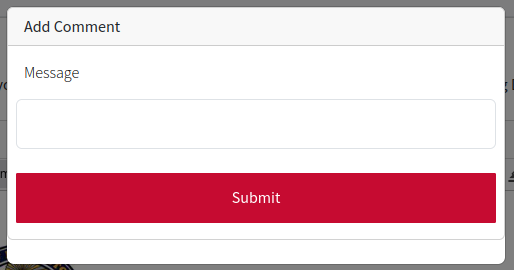

## Let's get this Workflow Started

When all the pertinent information has been added to the contract, you can initiate the workflow.

Permissions are given to individuals in each department. Standard users will only have the permission to route contract to department head. This button is inside of the document ribbon at the top of the page. Department heads or individuals designated by the department head will have the permission to start the workflow by routing the contract to the risk department. 

Once you route the contract to risk, all affected users will receive an email notification. That email notification will contain a red button, which is a direct link right back to the contract. That link is valid no matter whose queue the contract resides in. 

## Where's my contract now?

After the contract has entered into the workflow, you will not see the contract in the department review queue. To get a basic idea of where your contract is within the workflow, go to the workflow ribbon and click on department dashboard. 

This dashboard will show you all of the contracts that your department created and a progress bar indicating which part of the workflow it currently resides. It will also give you links to open the contract itself where you can view additional notes or documentation. 