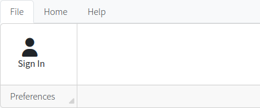
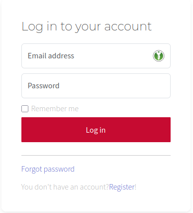
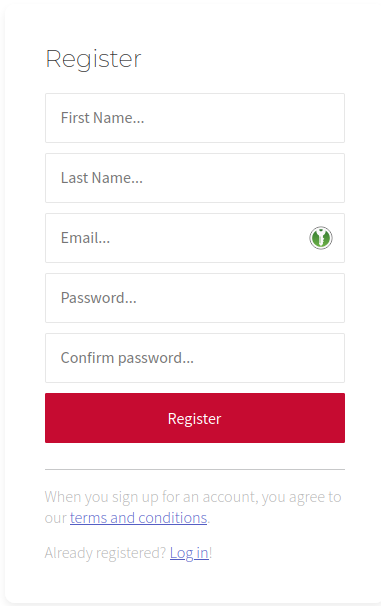

# Registering a New User Account

ECM users are not automicatlly added.  You must register first to the application, get approved and assigned to the proper
department manually.  to do so, follow the steps below.

1. From the File Ribbon, so to the Sign in Page and click on the link for Register.

2. Use your email address.

3. Fill out the Registration Form, including entering in your own password, twice.

* This password is specific to the ECM application.  It is NOT linked to your MIDNET credential, the account you use to log into your workstation.

 

4. You will receive an email that says "Welcome to the Electronic Contract Manager!
Your account is being reviewed by the administrator. You will receive an email when it has been activated. Thank you."

5. At this point your account will be activated and you will be assigned to the appropriate department.  An email will be sent back to you 
by the administrator when it is complete.
